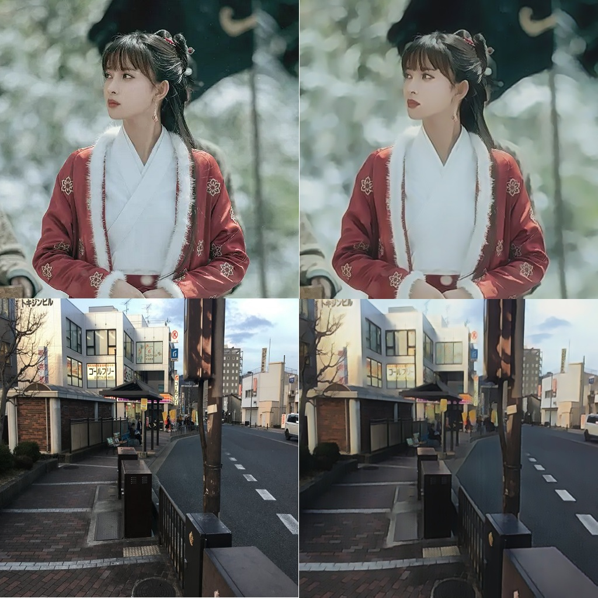

# AnimeGANv3 的 Pytorch 版本

([English](./README.md) | [中文](./Chinese.md))

这是基于原DTGAN模型实现的PyTorch版的AnimeGANv3模型

## 项目说明

由于 AnimeGANv3 采用了新的 DTGAN 模型，而且目前暂无对应的开源 PyTorch 解决方案，因此本项目依据原作者的 tensorflow 开源版本代码，对其中的部分内容进行迁移。

## 迁移内容

1. 将 DTGAN 主体模型框架迁移为 PyTorch 版本

2. 将训练所需要的 VGG19 相关模型迁移至 PyTorch ，并且已将原作者的 VGG19 模型参数导出为 .pth 格式文件供 PyTorch 调用

3. 将图片预处理操作转移至 prepearing.py 中统一完成

4. 将训练所需要的损失函数迁移至 PyTorch ，并且完成了相关的测试工作

## 使用说明

### 项目结构

- /dataset 用于存储训练所需要的图片文件

- /model_state 用于存储训练过程中的不同 Epoch 后的模型参数结果

- /tools 用于存储训练所需要的损失函数与图像增强方法

```tree
├───dataset
│   ├───ChinaPhoto
│   │   ├───smooth
│   │   ├───smooth_noise
│   │   └───style
│   ├───seg_train_5-0.8-50
│   ├───shinkai
│   │   ├───smooth
│   │   ├───smooth_noise
│   │   └───style
│   ├───test
│   │   ├───HR_photo
│   │   ├───label_map
│   │   ├───real
│   │   ├───test_photo
│   │   └───test_photo256
│   ├───train_photo
│   └───val
├───model_state
│   └───ChinaPhoto
├───tools
| DTGAN.py
| AnimeGAN.py
| preparing.py
| export_to_onnx.py
| 
| ·······
| ·······
```

### 初始化环境

- 安装 Python3
- 将项目克隆至本地
- 安装运行所需依赖

```shell
python -m pip install -r requirements.txt
```

### 数据准备

将训练所需要的图片缩放为256x256或512x512等尺寸，放入 /dataset 中的 /style 文件夹中，并运行以下命令行以对训练数据做预处理

```shell
python preparing.py --dataset ChinaPhoto --img_size 256
```

### 模型训练

可以使用以下命令行开始模型训练

```shell
python train.py --dataset ChinaPhoto --init_G_epoch 10 --epoch 50 --start_epoch 1 --batch_size 8 --device cpu
```

推荐使用 P100 及以上的 GPU 进行训练，也可尝试使用 DirectML 在非 NVIDIA 设备上进行训练

### 模型部署

- 项目支持以 ONNX 格式导出并部署。
- 导出的模型需要按 [batch, channel, height, width] 传入数据，且色彩通道为 BGR 类型
- 处理后的图片数据格式与传入图片的数据格式一致

```python
import onnxruntime as ort

model = ort.InferenceSession("./generate.onnx", providers=["CPUExecutionProvider"])
out_img = model.run(None, {"input": image_input})
show_image(out_img[0])
```

## 效果展示



## 授权许可

参考以下原作者的相关许可申明。

```plain
This repo is made freely available to academic and non-academic entities for non-commercial purposes such as academic research, teaching, scientific publications.  
Permission is granted to use the AnimeGANv3 given that you agree to my license terms.  
Regarding the request for commercial use, please contact us via email to help you obtain the authorization letter.
```

## 作者

Liu `liuzhi1999@foxmail.com`
